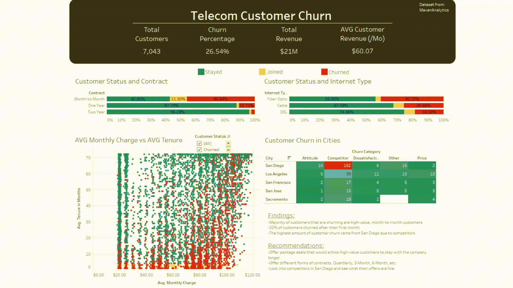

# Telecom Customer Churn

This project analyzes churn data from a telecommunications company. The dashboard was created in Tableau([link here](https://public.tableau.com/app/profile/clint.h1907/viz/CustomerChurn_16836920237420/Dashboard2)). The Jupyter Notebook can either be viewed in this repository or [here](https://clintbh.github.io/projects/amazonsalesdashboard/salesanalysis.html).

## Data Sources
* [Maven Analytics Telecom Customer Churn Challenge](https://www.mavenanalytics.io/challenges/maven-churn-challenge/6)
